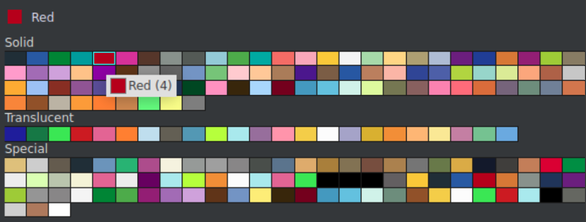

# LDR To Proto parser

This program parses an _.ldr_ or _.mdr_ file, which are created by an LEGO Brickbuilder like [LeoCAD](#TODO), into an usable .proto file. The .proto file will be saved inside the specified Webots directory and can be directly used inside of webots.

It is desired to create robot protos out of already designed Mindstorm NXT robots.

> This program is not desired to handle complex robots. This is because webots only supports a certain level of complexity. What is possible and what is not can be found [here](#TODO)

## Installation

To clone the repo just run following comand in the desired directory:

```bash
git clone https://TODO
```

In order to use this program you need to have some things set up. You can either follow the steps below and install everything by hand or you can run the installation script **after** you cloned the repo, which will do it for you:

```bash
chmod +x install.sh && source install.sh
```

### Prerequisities

You need to have a working installation of _node_ and _npm_ on your machine. After cloning this repo you should also run `git submodule --init --recursive` to pull all submodules. This will pull a repository containing all LEGO components.

### Installation

To install all the required dependencies run: `npm i`

### Running in Docker

TODO

## Usage

To start the parsing process just run:

```bash
npm start --
```

With the following argumnts:

| `-f <path to ldr or mdr file>` | Path to the file you want to parse                                          |
| ------------------------------ | --------------------------------------------------------------------------- |
| `-p <proto name>`              | Custom name of the resulting proto. Defaults to `LegoMindstormRoboterProto` |
| `-w <path to webots project>`  | Path to the webots project in which you want to use the proto               |

#### Example usage

```bash
npm start -- -f ../LeoCAD/foo.ldr -w ../webotsProject/
```

Will take the file `foo.ldr`, parses it and saved the resulting _.proto_ inside the proto directory of `webotsProject`.

## Supported elements

This program is especially designed to parse robots consisting out of NXT components. However, new components can be added with relative ease. How to add new components, like the newer Mindstorm EV3 components, can be found [here](#TODO).

Currently this program supports a number of different wheels, the NXT rotational Motor and a lot of the NXT sensors.

### Wheels

Everything about wheels can be found [here](/doc/wheels.md) in a dedicated documentation.

### NXT Components

Everything about the available NXT Components con be found [here](/doc/nxtElements.md).

## Build robots

When using this program to convert your roboter, built in LeoCAD, to an usable _.proto_ file you have to watch out for some small things to make everything work as expected.

### Submodules

You can use submoduls in LeoCAD to make building more maintainable. However, submodules without any extras will be merged with the main model.

### Hinge joints

Hinge joints connect two seperate parts. Both of these parts are moveable along a specified axis. To mark the hinge joint you have to have a _LEGO Technic Pin (3673)_ in the submodule file and a _Technic Pin_ at the same position of the submodules _Technic Pin_. You can easily create wheels with this method.

### Motors

A motor in webots is a hinge joint with an additional device element. For us, this device is a rotational motor. To mark such an motor you will do the same as for the normal hinge joint **but** additionally one of the _Technic Pins_ must have the color id 4, which is the default red color.



However, you can change the id in the [configuration](#TODO) file by changing the value of the `motor_detection_color_id` key.

> Creating a rotational motor does not require you to have a NXT Motor or any other motor set up. This means, you theoretically can place a motor everywhere you want to. Though, we strongly advise you not to do so and only you motors where you have a motor element set up, because not doing so will definitelly break your roboter in the reality.

## Add new elements

A detailed documentation of how to add new elements to this program can be found [here](#TODO).

## Possibilities
