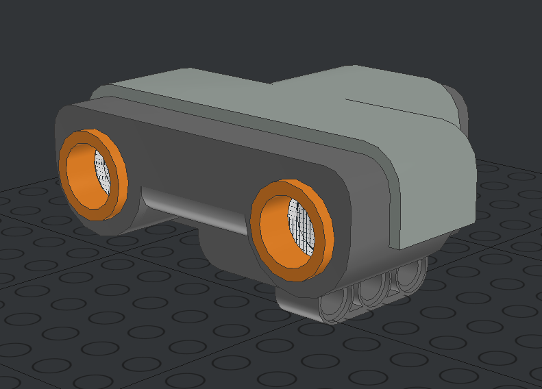
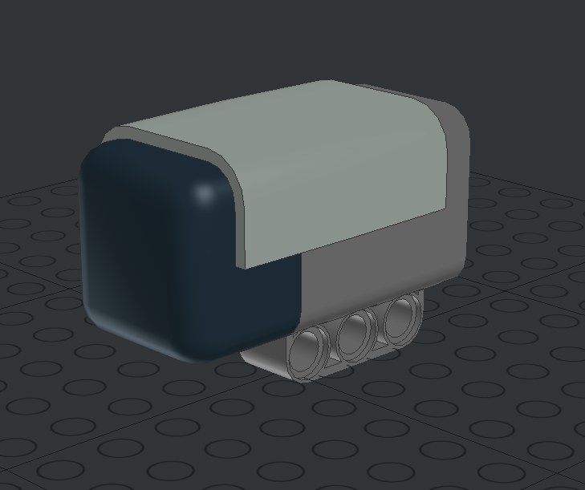
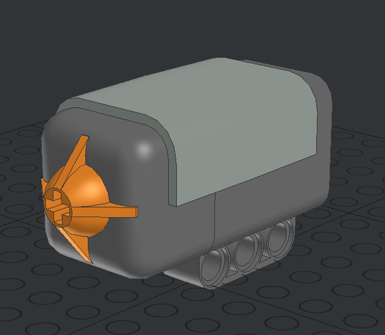

# NXT Elements

This document will list all usable MindStorm NXT elements. Usable elements are all elements that will be converted to a sensor or motor in webots.

> Even tho not all sensors or motors are listed here, they can still be used inside the Lego Builder and are converted and included in the proto. However they will not contain any sensor or motor elements and can not be used in the code. This is, because not all sensors are available in webots. You can find more about the boundaries of this program [here](#TODO)

## NXT Motor

The NXT Motor itself has no special characteristic and wont be converted to a rotational motor or a hinge joint in webots. How to create motors can be found [here](#TODO)

## NXT Sensors

List of available sensors:

| Sensor image                                   | Sensor details                                                             |
| ---------------------------------------------- | -------------------------------------------------------------------------- |
|   | **Ultrasonic sensor** ID: _53792_ Range: _2.55m_ Aperture: 0.2618 |
|  | **Compass sensor** ID: _ms1034_                                         |

The default configurations of all sensors can be edited [here](#TODO).

|  | **Touch sensor** ID: _53793_ |
