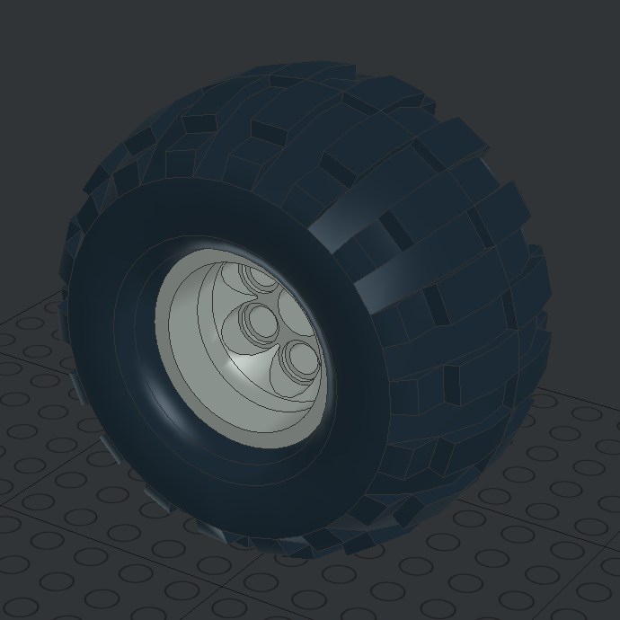
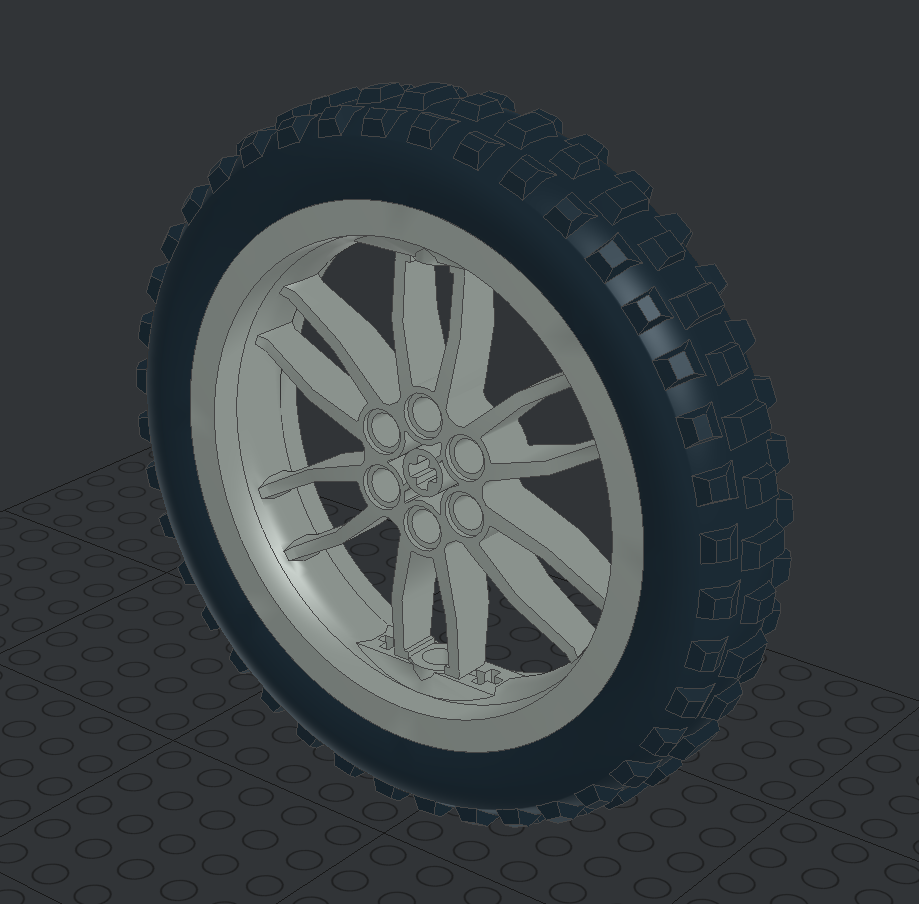

# Wheels

Wheels are the only elements that are generated with a bounding object. For each wheel the bounding object will be a cylinder with the specified radius and height.

> Read [here](#TODO) how you can create a wheel inside LeoCAD or your preferable brickbuilder IDE.

## Supported wheels

Values for radius and height are in cm.

|  | **22253c02**  height: _2.8_  radius: _2.48_  |    | **22253c01**  height: _3_  radius: _2.8_     |
| --------------------------------------------------------------------------- | -------------------------------------------------- | ----------------------------------------------------------------------------- | -------------------------------------------------- |
|    | **6595c02**  height: _2.8_  radius: _2.48_   |      | **6595c01**  height: _3_  radius: _2.8_      |
|  | **22969c02**  height: _6_  radius: _5.2_     |    | **22969c01**  height: _6_  radius: _5.2_     |
|  | **56903c01**  height: _0.75_  radius: _1.17_ |      | **2695c01**  height: _1.3_  radius: _2.18_   |
|  | **56904c01**  height: _1.4_  radius: _2.15_  |    | **56145c01**  height: _2.65_  radius: _2.15_ |
|  | **56908c01**  height: _3.8_  radius: _4.1_   |    | **56908c02**  height: _4_  radius: _4.1_     |
|    | **2996c01**  height: _4_  radius: _3.44_     |    | **44772c02**  height: _4_  radius: _5.3_     |
|        | **44293**  height: _1.4_  radius: _1.84_     |    | **15038c01**  height: _4_  radius: _5.3_     |
|  | **88517c01**  height: _1.8_  radius: _5_     |  | **32004bc01**  height: _2.3_  radius: _3.4_  |

## Add wheels

A documentation of how you can add new wheels can be found [here](#./addElements.md).
